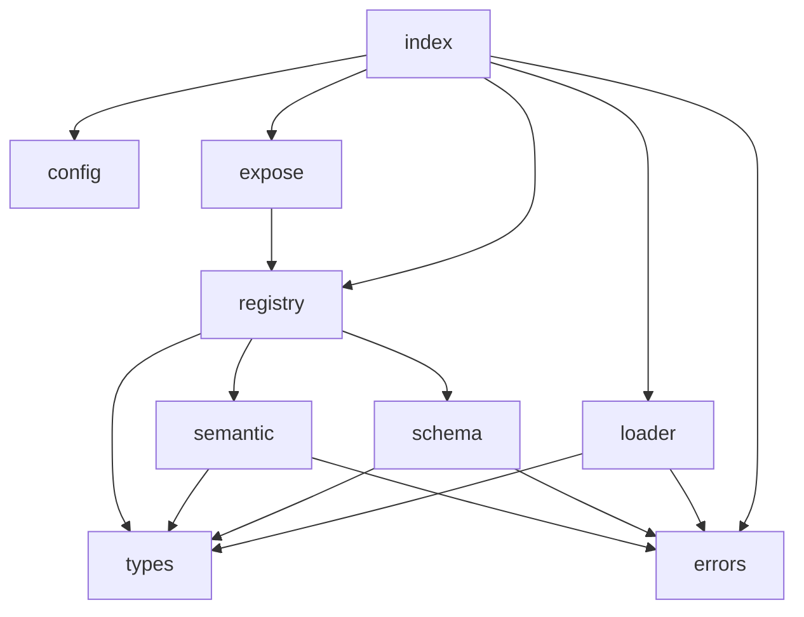

# CDP v0.1 设计文档 — `dsh-cdp-metadata`

> 作者：高见远（架构师）。状态：阶段一设计稿已完成评审，阶段二编码已落地（v0.1.0）。
> 配套文档：`PRIOR-ART.md`（既有协议对照）、`CDP-SCHEMA.v0.1.json`（规范单一真理源）。
> 本插件**只**是只读元数据层，不桥接、不注册工具、不执行任何被注解代码。

---

## 1. 问题陈述

现有插件/工具在 DSH 里被模型"看见"的只有两块自然语言 + 结构化信息：

- `definition.description`：一段给人/模型读的 prose；
- `definition.parameters`：JSON Schema 形式的入参约束。

这两块足够回答"怎么调用、传什么参数"，但**回答不了三个更高层的问题**：

| 模型真正需要知道的事 | 现有 description 能表达吗 | 后果 |
|---|---|---|
| 这个能力**怎么推理**（演绎/归纳/溯因）、不确定性是否显式、失败是 fail-loud 还是 fail-silent | 不能 | Agent 无法预判"它出错时会怎样""它的结论有多可信" |
| 这个能力**产出什么语义**（标签）、**下一步该交给谁** | 不能 | 跨插件路由只能靠模型临时猜，或靠硬编码 |
| 调用它**有什么副作用、花多少成本**（算力/时延/钱） | 不能 | 无法在编排层做副作用分级与成本预算，权限决策缺依据 |

于是 Agent 只能从 `description` 的措辞里"猜"这些属性。CDP 不是要重造工具定义，而是补**这层 AI 可读的能力语义**：在工具定义之外，附一份结构化、可机器校验、可静态路由的元数据。

**理论价值（用户原话）**：看清原来看不见的脆弱性——例如 `cannot` 与 `can` 的自相矛盾、声明 `none` 副作用却列出 `scope`、把"预测涨跌"包装成"分析"——而不是概念本身的新颖性。

---

## 2. 设计目标与非目标

### 目标
- 给能力附加结构化语义元数据（cognitive_style / semantic_tags+downstream_hints / side_effects+cost）。
- 提供三层校验模型（§4）：L1 语法 + L2 静态语义**落地**，L3 行为验证**仅留接口 + TODO 不实现**（诚实标注不可行）。
- 作为 `ctx.cdpRegistry` 服务暴露，供未来 adapter / prompt 组装消费。
- 与 `dsh-cordis-universal-adapter` **严格正交**（见 §7）。

### 非目标（明确不做）
| 非目标 | 原因 |
|---|---|
| MCP 桥接 | 那是桥接 adapter 的职责，CDP 是上层语义层 |
| 工具注册（`ctx.tools.register`） | 只读元数据，绝不污染工具表 |
| 沙箱 / 执行被注解代码 | 无执行权限、无沙箱，且 L3 需要执行（见 §4） |
| L3 行为验证 | 不可行，仅留接口 + TODO（见 §4） |
| 运行时拦截（包裹 `tools/execute`） | 不做拦截，不做权限网关 |

---

## 3. CDP v0.1 数据模型

顶层结构：`{ "capability": { ... } }`。逐字段表（完整 JSON Schema 见 `CDP-SCHEMA.v0.1.json`，二者互为镜像）：

| 字段路径 | 类型 | 必填 | 枚举 / 格式 | 语义 | 为什么需要 |
|---|---|---|---|---|---|
| `capability.id` | string | 是 | `name@v?\d+.\d+` | 能力唯一标识，注册表主键 | 去重、绑定、检索 |
| `capability.identity.name` | string | 是 | — | 人类可读名（可中文） | 展示与检索 |
| `capability.identity.archetype` | enum | 是 | analyzer/executor/advisor/orchestrator/validator | 角色原型 | 路由与编排依据 |
| `capability.boundaries.can` | string[] | 是 | — | 能做到的事 | 划定能力边界 |
| `capability.boundaries.cannot` | string[] | 是 | — | 明确不做的事 | L2 冲突检测对象（§4） |
| `capability.boundaries.requires` | string[] | 是 | — | 前置条件 | 使用前置校验 |
| `capability.cognitive_style.reasoning_type` | enum | 是 | deductive/inductive/abductive | 推理范式 | **核心原创**：认知人格声明 |
| `capability.cognitive_style.uncertainty_expression` | enum | 是 | explicit/implicit | 不确定性是否显式 | 预测可信度评估 |
| `capability.cognitive_style.failure_mode` | enum | 是 | fail_loud/fail_silent | 失败表现 | 错误传播预期 |
| `capability.cognitive_style.archetype` | enum | 是 | 同 identity | 与 identity 对齐 | 不一致时 L2 告警 |
| `capability.output.semantic_tags` | string[] | 是 | — | 输出语义标签 | 跨插件路由与检索键 |
| `capability.output.downstream_hints` | array | 是 | `{if_tag, suggest_to}[]` | 路由提示 | 跨插件编排 |
| `capability.runtime.side_effects.level` | enum | 是 | none/read-only/state-changing/irreversible | 副作用分级 | 与 DSH 权限三档正交 |
| `capability.runtime.side_effects.scope` | string[] | 是 | — | 受影响范围 | 越界告警 |
| `capability.runtime.cost.compute` | enum | 是 | low/mid/high | 算力分级 | 成本预算 |
| `capability.runtime.cost.latency` | string | 是 | `^(<)?\d+(\.\d+)?(ms|[smh])$` | 时延上界（如 `<1s`） | 编排时延约束 |
| `capability.runtime.cost.monetary` | enum | 是 | free/per_call/metered | 货币模型 | 成本预算 |

**诚实说明**：`cognitive_style`、`semantic_tags/downstream_hints`、`side_effects/cost` 全部是**作者自陈声明**，本插件不做任何运行时验证（L3 不可行，见 §4）。它们提供的是"声明式契约"，其真实性由作者负责。

---

## 4. 三层校验模型

### L1 — 语法校验
- 实现：`zod/v4` 结构与枚举校验（`src/schema.ts`），镜像 `CDP-SCHEMA.v0.1.json`。
- 覆盖：必填字段存在、枚举合法、`id`/`latency` 格式、数组项非空、禁止未知字段（`additionalProperties:false`）。
- 失败 → `CdpValidationError(level:'L1', path, reason)`。

### L2 — 语义静态检查
纯静态、字符串级，不执行任何代码。由一组 rule 函数组成，每个返回 `CdpValidationError[]`：

**(a) `boundaries.can` 与 `cannot` 冲突检测（核心算法）**
```
normalize(s) = s.trim().toLowerCase().replace(/\s+/g, ' ')
NEG = ['不','不能','无法','禁止','拒绝','别','勿','无','没','没有',
       'non-','not ','never ','disallow','forbid']

1. 直接相交：∃ c∈can, x∈cannot, normalize(c)===normalize(x)
   → 错误："can/cannot 直接矛盾"

2. 否定启发式：对每条 x∈cannot：
   stripped = 去掉 x 头部一个 NEG 标记后的 normalize(x)
   对每条 c∈can：
     若 stripped===normalize(c) 或 二者互为首尾包含（token 边界内）
     → 错误："cannot 项是 can 项的语义否定"
   对称处理：can 项带否定、cannot 项为肯定式，同样判。
```
- **诚实边界**：这是字符串级启发式，**不是语义推理**。会漏检：
  - 同义改写：`cannot:["提供投资意见"]` vs `can:["给投资建议"]` 因字面不同漏检；
  - 抽象层级不同：`cannot:["预测明天"]` vs `can:["预测趋势"]` 可能误报或漏检；
  - 多语言/缩写不一致。
  - 因此 L2 冲突检测**只能兜底明显矛盾**，不能证明 `cannot` 声明成立。

**(b) `downstream_hints.if_tag` 必须命中 `semantic_tags`**
对每条 hint：`semantic_tags.includes(hint.if_tag)` 否则错误 `"downstream_hints.if_tag 未出现在 semantic_tags"`。

**(c) `cost.latency` 格式**：正则 `^(<)?\d+(\.\d+)?(ms|[smh])$`，否则错误。

**(d) 跨字段一致性（L2 告警级）**
- `side_effects.level==='none'` 但 `scope.length>0` → 告警"声明无副作用却列出 scope"。
- `identity.archetype !== cognitive_style.archetype` → 告警"archetype 两处不一致"。
- 这些不阻断注册，但随 `onInvalid` 语义上报（§5）。

### L3 — 行为验证（**仅留接口 + TODO，不实现**）
- 接口占位：`interface CdpBehaviorOracle { verify(cap, against): Promise<VerificationReport> }`（在 `src/semantic.ts` 留 `// TODO L3` 与签名，无实现）。
- **为什么不可行**：
  1. 需要真实执行被注解工具并构造对抗样本 → 本插件是只读元数据层、**无执行权限、无沙箱**；
  2. 需要 oracle 判定 `can/cannot` 是否被违反 → 这类"能力边界"断言**数学上常不可反驳**：
     例如 `cannot:["预测明天股价涨跌"]`——无法用有限样本证明"模型从不预测"，只能证明"某次没预测"；
  3. 执行不可信代码本身引入安全风险，与 §9 安全模型冲突。
- 结论：L3 超出本插件定位，交由未来带沙箱的验证子系统，或人工审计。

---

## 5. 错误模型

```ts
class CdpValidationError extends Error {
  constructor(public path: string, public reason: string, public level: 'L1' | 'L2') { ... }
}
class CdpValidationAggregateError extends Error {
  constructor(public errors: readonly CdpValidationError[]) { ... }
}
class CdpSecurityError extends Error { /* 路径逃逸等，永远抛，不受 onInvalid 控制 */ }
```

- **禁止吞错**：所有校验失败必须上抛为上述类型，不得静默 `catch` 后丢弃。
- `validation.onInvalid: 'warn' | 'error'` 语义：
  - `error`：任一 L1/L2 失败 → 聚合为 `CdpValidationAggregateError` 抛出，插件 effect 失败（cordis 按常规处理）。
  - `warn`：L1/L2 失败仅以 `[cdp]` 前缀日志输出，对应 capability **仍注册**（信任作者声明，元数据可用），但问题被显式暴露。
  - `CdpSecurityError`（路径逃逸）**不受 onInvalid 控制，永远抛**——安全错误不可降级。
- 单条错误携带 `path`（如 `capability.boundaries.cannot[0]`）便于定位。

---

## 6. `attachToTools` 技术论证与最终决策

### 6.1 用户原始需求里的"假功能"（已证伪）
原始设想"遍历 `ctx.tools.schemas()` 为每工具追加 description"**若照字面实现会是假功能**。已实地核对 dsh-tools 运行时（`@deepseek-ai/dsh-tools/lib/index.js`）：

- `schemas(scope)` 实现为 `[...view(scope).visible.values()].map(d => this.schemaOf(d, true))`（`index.js:2900`）。
- `schemaOf(def, detach)` **新建对象** `{name, description, parameters: snapshotJsonValue(parameters)}`（`index.js:2916-2925`）。
- → 改 `schemas()` 返回数组里对象的 `description`，只改了**投影副本**，**对注册表完全无效（no-op）**。

### 6.2 唯一可行的副作用路径
- `get(name, scope)` 实现为 `return this.view(scope).visible.get(name)`（`index.js:2872`），返回的是 layer 中**活的 `ToolDefinition` 引用**。
- 改它的 `description` 会真实影响后续 `schemaOf()` 投影（`schemaOf` 读 `definition.description` 是实时读取），即真正改变模型可见文本。
- 但 dsh-tools 的 `interface Events`（`lib/types/index.d.ts:28`）**只有执行期 waterfall**：`tools/pre-execute`、`tools/execute`、`tools/post-execute`、`tools/code-dispatch-log`、`tools/result`、`tools/change`。**没有任何 schema/description 投影期的装饰事件缝** → 无法用事件钩子"优雅"注入，只能直接改活引用。

### 6.3 最终决策（采纳 team-lead 四段方案，并细化）
**决策：默认 `attachToTools: false`；提供纯函数投影 API `registry.decorateSchemas`；仅当显式开启且经 `ctx.tools.get` 活引用改 description，且必须有幂等守卫 + 还原 disposer。**

理由：
1. **默认 false**——避免任何非必要副作用；元数据层默认零侵入。
2. **纯函数 `decorateSchemas(schemas, bindings)`**——返回带 `[CDP: …]` 后缀的**副本**，零副作用，供 adapter / 未来 prompt 组装消费。这是推荐的主路径。
3. **`attachToTools: true` 时的活引用改写**（仅在用户明确要求时）：
   - 经 `ctx.tools.get(toolName)` 取活 `definition`；
   - **幂等守卫**：用 `WeakMap<Definition, originalDescription>` 记录原始值；若已记录或 `description` 已含哨兵 `[cdp]` 则跳过；
   - **只碰 `description`，绝不碰 `parameters` / `execute`**；
   - 改写内容：`description + ' ' + registry.formatMarker(cap)`；marker 形如
     `[CDP: deductive/explicit/fail_loud | SE:none | $:free]`（紧凑、模型可读）；
   - **可逆副作用纪律**：在 `ctx.effect(async () => { …; return () => restore })`
     的 disposer 里把 `description` **还原**为原始值（cordis fiber 卸载时自动触发）；
   - 若 `ctx.tools` 或 `ctx.tools.get` 不存在 → **安静跳过，不报错**（点 ④）。
4. **绑定来源**：`expose.bindings: Record<capabilityId, toolName>`（落在允许的配置段 `expose` 内），显式声明"哪个能力注解哪只工具"。不靠名字猜测（样例 `identity.name` 是中文，无法与工具名匹配）。

**保留的坦诚风险**：直接改 `definition.description` 依赖 dsh-tools 内部契约（活引用）。已验证当前 `@deepseek-ai/dsh-tools` 行为，但属私有契约，未来版本变更会破——此风险记入 §10。

---

## 7. 与 `dsh-cordis-universal-adapter` 的正交性矩阵

> **约束范围澄清**：硬约束"不得出现 `cordis-universal-adapter` 字样"约束的是**本插件自身的标识面**——包名、插件 id、`ctx.provide` 服务名、工具命名前缀、依赖声明。文档中为说明正交关系而**引用**该包的真实名称是必要且允许的；本插件代码不 import、不依赖它。

| 维度 | `dsh-cordis-universal-adapter` | `dsh-cdp-metadata` | 是否冲突 |
|---|---|---|---|
| 包名 / 插件 id | `dsh-cordis-universal-adapter` | `dsh-cdp-metadata` | 否 |
| `inject` | `['tools','llm']` | `[]`（只读，不注入） | 否 |
| 注册工具到 `ctx.tools` | 是（`ctx.tools.register`） | **否** | 否 |
| 连接 MCP server/client | 是 | **否** | 否 |
| `ctx.provide` 服务 | `universalAdapter` | `cdpRegistry`（严禁 universalAdapter） | 否 |
| 命名前缀 | `mcp::` / `dsh:`（`prefixSeparator:':'`） | **无前缀** | 否 |
| config 段 | servers/pluginDirs/export/router/naming/schema/logging | **仅** sources/validation/expose | 否 |
| peerDependencies | 含 `@modelcontextprotocol/*` | 仅 `@deepseek-ai/cordis`、`@deepseek-ai/dsh-tools` | 否 |
| 关注层 | 传输 / 协议桥接 | 语义元数据（上层） | 否（上下层正交） |

**关系定位**：CDP 是 `dsh-cordis-universal-adapter` 的**上层语义层**。二者可同时安装、互不引用代码；未来该 adapter 可直接消费 `ctx.cdpRegistry`，给它桥接进来的 MCP 工具附加 CDP 注解，而本插件代码**不 import** 该 adapter。

**重复 id 冲突策略**：默认 `prefix`（与该 adapter 的 `naming.conflictStrategy='prefix'` 概念一致）；可通过 `validation.conflictStrategy` 改为 `error`。`prefix` 时对重复 `id` 采用 `id + '#' + n` 后缀（用 `#` 而非 `:` 以避免与该 adapter 的命名空间混淆）。

---

## 8. 安全模型

- **唯一 IO 依赖**：`node:fs/promises`。禁用 `child_process`、禁用 `eval`/`new Function`、禁用动态 `import()` 被注解代码、绝不执行被注解能力。
- **`sources` 路径白名单**（防穿越 / 防符号链接逃逸）：
  1. `root = path.resolve(cfg.sources.root)`；
  2. 对每个 `entry ∈ cfg.sources.paths`：`abs = path.resolve(root, entry)`；
  3. 拒绝 `entry === '/'` 或等价于 root 本身（要求显式文件/目录）；
  4. 拒绝逃逸：必须 `abs === root || abs.startsWith(root + path.sep)`（阻断 `..` 与绝对路径逃逸）；
  5. **符号链接逃逸**：`realpath(abs)` 与 `realpath(root)` 必须满足 `realpath(abs).startsWith(realpath(root) + sep)`（realpath 解析软链后仍需落在 root 内）；
  6. 任一不满足 → 抛 `CdpSecurityError`（不可降级）。
- **DoS 防护**（具体值，可在 config 调）：
  - 单文件大小上限 `maxFileBytes = 1_048_576`（1 MiB），超出则跳过并记入 `skipped`；
  - 扫描深度上限 `maxDepth = 8`；
  - 扫描文件总数上限 `maxFiles = 1000`，超出停止并告警。
- 解析得到的 JSON 仅做 `JSON.parse` + L1/L2 校验，**不实例化、不执行**其中任何代码/函数。

---

## 9. 模块契约与任务分解

### 9.1 文件职责与导出签名（TypeScript 级）
| 文件 | 职责 | 关键导出签名 |
|---|---|---|
| `src/types.ts` | 类型定义（镜像 Schema） | `interface Capability`, `CognitiveStyle`, `Boundaries`, `Output`, `Runtime`, `SideEffects`, `Cost`, 各 enum union 类型, `ValidationLevel` |
| `src/errors.ts` | 错误类型 | `class CdpValidationError`, `class CdpValidationAggregateError`, `class CdpSecurityError` |
| `src/config.ts` | 配置 zod schema | `interface CdpConfig { sources; validation; expose }`, `const configSchema` |
| `src/schema.ts` | L1 校验 | `const capabilitySchema`, `validateSyntax(doc): {value} \| {errors}` |
| `src/loader.ts` | 源加载（白名单+限额） | `async loadSources(cfg): Promise<{capabilities, skipped}>` |
| `src/semantic.ts` | L2 校验 + L3 占位 | `checkConflicts`, `checkTagHints`, `checkCrossField`, `runL2(cap): CdpValidationError[]`；`// TODO L3 CdpBehaviorOracle` |
| `src/registry.ts` | 注册表 + 投影 | `class CdpRegistry { register; get; list; formatMarker; decorateSchemas }`；`interface ToolSchema` |
| `src/expose.ts` | attachToTools | `attachToTools(ctx, registry, bindings, restore): () => void` |
| `src/index.ts` | 插件入口 | `export const name='dsh-cdp-metadata'`；`export const inject=[]`；`apply(ctx, config)` |

### 9.2 依赖图（Mermaid）


### 9.3 实现顺序（阶段二，供工程师排期）
1. `types.ts` — 先把类型立住，全局共享。
2. `errors.ts` — 错误模型，后续都依赖。
3. `config.ts` — 配置 schema（sources/validation/expose 三段）。
4. `schema.ts` — L1，须与 `CDP-SCHEMA.v0.1.json` 逐项对齐。
5. `loader.ts` — 安全加载，先把"读得进来且安全"做对。
6. `semantic.ts` — L2（冲突/标签/跨字段）+ L3 占位。
7. `registry.ts` — 注册表、冲突策略、`decorateSchemas` 纯函数。
8. `expose.ts` — `attachToTools` 活引用改写 + 还原 disposer。
9. `index.ts` — 串联：`provide('cdpRegistry')` → `effect` 内 load → 校验 → register → 按 config 决定是否 attach。

### 9.4 跨文件共享约定
- **禁止 `any`**：统一 `unknown` + 显式类型守卫（`isCapability` 等）。
- **相对导入带扩展名**：NodeNext/ESM 下写 `import { X } from './types.js'`。
- **日志前缀统一 `[cdp]`**；不污染 `ctx.tools`、不触碰 `parameters`/`execute`。
- 纯函数优先：`decorateSchemas`、`checkXxx`、`normalize` 等均无副作用，便于单测。
- `ToolSchema` 形态与 dsh-tools `schemaOf` 输出对齐：`{ name: string; description: string; parameters: unknown }`。

---

## 10. 已知限制清单

1. **L2 是字符串启发式**：can/cannot 矛盾检测会漏检同义改写与抽象层级差异，不是语义推理（§4）。
2. **L3 未实现且不可行**：`cannot` 类声明数学上常不可反驳；本插件无沙箱、无执行权限（§4）。
3. **`attachToTools` 依赖私有契约**：直接改 `definition.description` 依赖 dsh-tools 当前实现（活引用）；未来版本变更会破，需回归测试守护（§6）。
4. **声明即信任**：cognitive_style / cost / side_effects 均为作者自陈，CDP 不验证真实性；恶意或粗心作者可伪造。
5. **无版本协商**：仅 `id@vX.Y` 字符串，无字段级向后兼容机制；破坏性变更需作者自行管理。
6. **跨语言能力弱**：冲突检测、匹配均基于字面归一化，中英文混写/缩写不一致会失效。
7. **cost/latency 为静态估计**：非实测值，随环境变化可能失真。
8. **绑定需显式**：`expose.bindings` 需人工维护 capabilityId↔toolName 映射，无自动发现。
